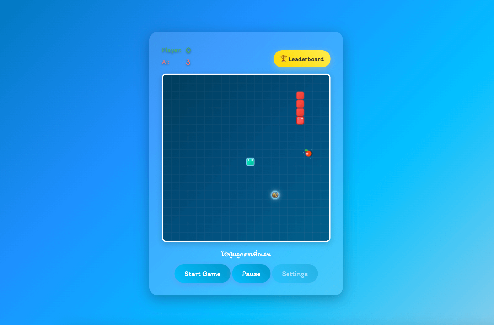

# 🐍 เกมงู Snake Game HTML

เกมงูคลาสสิกที่พัฒนาด้วย HTML5 Canvas, JavaScript และ CSS โดยอ้างอิงและต่อยอดจาก[บทความสอนสร้างเกมงูใน HTML](https://www.devahoy.com/blog/2025/create-snake-game-html) ของ Devahoy

ทดลองเล่นเกมได้ที่: [Snake Game Demo](https://snake-game-html-with-claude.vercel.app/)



> **📝 Note**: README.md นี้ถูกสร้างโดย [Claude Code](https://claude.ai/code) - AI coding assistant ที่ช่วยในการสร้างเอกสารและการพัฒนาโค้ด

## ✨ ฟีเจอร์หลัก

### 🎮 ฟีเจอร์เกมพื้นฐาน

- **การเล่นแบบคลาสสิก**: งูเคลื่อนที่กินอาหารและเติบโตขึ้น
- **ระบบคะแนน**: นับคะแนนและบันทึกคะแนนสูงสุด
- **การชนตัวเอง/กำแพง**: ตรวจจับการชนและจบเกม
- **การควบคุม**: ใช้ปุ่มลูกศรสำหรับการเคลื่อนที่

### 🎨 ฟีเจอร์ขั้นสูง

- **ธีมสีหลากหลาย**: ธีมเริ่มต้น, ธีมมืด, ธีมท้องทะเล, ธีมพระอาทิตย์ตก
- **ระดับความยาก**: 3 ระดับ (ง่าย, ปานกลาง, ยาก)
- **ขนาดเกมปรับได้**: เล็ก (300x300), ปานกลาง (400x400), ใหญ่ (500x500)
- **โหมด AI**: เล่นกับคอมพิวเตอร์ได้
- **ระบบเสียง**: เปิด/ปิดเสียงได้
- **Leaderboard**: ตารางคะแนนสูงสุด
- **Power-ups**: ไอเท็มพิเศษในเกม

### 🎯 UI/UX ที่ทันสมัย

- **ภาษาไทย**: อินเทอร์เฟซเป็นภาษาไทยทั้งหมด
- **Glassmorphism Design**: ดีไซน์แก้วใสทันสมัย
- **Google Fonts**: ใช้ฟอนต์ "Itim" สำหรับความสวยงาม
- **Responsive**: ปรับขนาดได้ตามหน้าจอ

## 🚀 วิธีการรัน

### ติดตั้ง Dependencies

```bash
# ใช้ Bun (แนะนำ)
bun install

# หรือใช้ npm
npm install
```

### รันเกม

```bash
# เริ่ม development server
bun run dev

# หรือใช้ npm
npm run dev
```

### Build สำหรับ Production

```bash
# สร้างไฟล์ build
bun run build

# ดูตัวอย่าง build
bun run preview
```

## 🏗️ โครงสร้างโปรเจค

```
snake-game-html/
├── index.html          # หน้าเว็บหลัก
├── src/
│   ├── main.js         # ไฟล์หลักสำหรับเริ่มเกม
│   ├── game.js         # ตรรกะหลักของเกม
│   ├── ui.js           # การจัดการ UI
│   ├── ai.js           # ระบบ AI
│   ├── powerups.js     # ระบบ Power-ups
│   └── styles.css      # สไตล์ CSS
├── public/
│   └── vite.svg        # ไอคอน
├── package.json        # การตั้งค่าโปรเจค
└── bun.lock           # ไฟล์ lock สำหรับ dependencies
```

## 🎮 วิธีการเล่น

1. **การเคลื่อนที่**: ใช้ปุ่มลูกศร ↑ ↓ ← → บนคีย์บอร์ด
2. **เป้าหมาย**: ควบคุมงูให้กินอาหาร (จุดสีแดง) เพื่อได้คะแนนและเติบโต
3. **การแพ้**: หลีกเลี่ยงการชนกำแพงหรือชนตัวเอง
4. **คะแนน**: ยิ่งกินอาหารได้มาก ยิ่งได้คะแนนสูง

## ⚙️ การตั้งค่า

เข้าถึงการตั้งค่าผ่านปุ่ม "Settings" ในเกม:

- **ธีมสี**: เลือกธีมสีที่ชอบ
- **ระดับความยาก**: ปรับความเร็วของเกม
- **ขนาดเกม**: เปลี่ยนขนาดพื้นที่เล่น
- **เสียง**: เปิด/ปิดเสียงเกม
- **โหมด AI**: เล่นกับคอมพิวเตอร์

## 🏆 ระบบคะแนน

- คะแนนจะถูกบันทึกใน Local Storage
- สามารถดู Leaderboard ได้ผ่านปุ่ม "🏆 Leaderboard"
- ระบบจะขอให้ใส่ชื่อเมื่อทำคะแนนสูง

## 🤖 โหมด AI

เกมมีโหมด AI ที่สามารถ:

- เล่นแข่งกับผู้เล่น
- มีระดับความยาก 2 ระดับ
- แสดงคะแนน AI แยกต่างหาก

## 🛠️ เทคโนโลยีที่ใช้

- **HTML5 Canvas**: สำหรับการวาดและเรนเดอร์เกม
- **Vanilla JavaScript**: ตรรกะเกมและการจัดการ DOM
- **CSS3**: สไตลิ่งและ Glassmorphism effects
- **Vite**: Build tool และ development server
- **Bun**: Package manager (เร็วกว่า npm)

## 📚 การเรียนรู้และต่อยอด

เกมนี้เหมาะสำหรับ:

- ผู้เริ่มเรียน Game Development
- การเรียนรู้ HTML5 Canvas
- การฝึก JavaScript และ DOM Manipulation
- การศึกษา Game State Management

### ไอเดียการต่อยอด

- เพิ่มระดับเกมหลายด่าน
- ระบบ Multiplayer แบบ Online
- การเชื่อมต่อกับ Database สำหรับคะแนน
- เพิ่มเอฟเฟกต์เสียงและภาพที่หลากหลาย
- การสร้าง Mobile App ด้วย Cordova/PhoneGap

## 📖 อ้างอิง

บทความต้นฉบับ: [สร้างเกม Snake ด้วย HTML](https://www.devahoy.com/blog/2025/create-snake-game-html) โดย Devahoy

เกมนี้ได้รับแรงบันดาลใจและต่อยอดจากบทความดังกล่าว โดยเพิ่มฟีเจอร์ขั้นสูงมากมายเพื่อให้เป็นเกมที่สมบูรณ์และทันสมัยมากขึ้น

## 📄 License

โปรเจคนี้เป็น Open Source สามารถนำไปใช้และแก้ไขได้อย่างเสรี

## 🤖 Vibe Coding with Claude Code

โปรเจคนี้พัฒนาด้วย **Claude Code** - AI coding assistant ที่ช่วยให้การเขียนโค้ดเป็นเรื่องสนุกและมีประสิทธิภาพ!

### ✨ Claude Code Features ที่ใช้ในโปรเจค:

- **🔍 Smart Code Search**: ค้นหาโค้ดและไฟล์ได้อย่างชาญฉลาด
- **📝 Auto Documentation**: สร้างเอกสารโค้ดอัตโนมัติ
- **🛠️ Refactoring Tools**: ปรับโครงสร้างโค้ดให้ดีขึ้น
- **🎯 Context-Aware Coding**: เข้าใจบริบทของโปรเจคและเขียนโค้ดที่เหมาะสม
- **🚀 Rapid Prototyping**: สร้างต้นแบบได้อย่างรวดเร็ว

### 🎮 การพัฒนาแบบ Vibe Coding:

1. **Flow State**: Claude Code ช่วยให้เข้าสู่ Flow State ในการเขียนโค้ดได้ง่าย
2. **Creative Coding**: ช่วยในการสร้างสรรค์ฟีเจอร์ใหม่ๆ แบบไม่มีขีดจำกัด
3. **Instant Feedback**: ได้รับ feedback ทันทีระหว่างการเขียนโค้ด
4. **Learning by Doing**: เรียนรู้เทคนิคใหม่ๆ ไปพร้อมกับการเขียนโค้ด

### 💡 Tips สำหรับ Vibe Coding:

- ใช้ Claude Code เป็นคู่หูในการ brainstorm ไอเดีย
- ให้ AI ช่วยในการเขียนโค้ดที่ซับซ้อน
- ใช้ AI ในการ debug และหาปัญหา
- ให้ AI ช่วยในการเขียน documentation และ comment

---

สร้างด้วย ❤️ และ 🤖 **Claude Code** โดยอ้างอิงจาก [Devahoy Tutorial](https://www.devahoy.com/blog/2025/create-snake-game-html)

> "Vibe coding คือการเขียนโค้ดที่ผสมผสานระหว่างความคิดสร้างสรรค์ของมนุษย์กับความชาญฉลาดของ AI"
